# Analysis of Algorithm

*The theoretical study of computer program **performance** and resource usage*

## What's more important than performance

   Correctibility, feature, robustin etc...

## Why study algorithms and performance

   ~~Opening question, No anwser~~

## Problem: Sorting

Input: sequance < a1, a2 ..., an> of numbers  
Ouput: permutation of those < A1, A2 ..., An > numbers  
*Such that: A1 < A2 < ... < An*

### Insertion sort

- *Pesudocode*

<pre>
Insertion_Sort(A, n) //Sorts A[1..n]
    for j <- 2 to n
        do key <- A[j]
            i <- (j-1)
            while i >= 0 and A[i] >= key
                do A[i + 1] <-> A[i]
                    i <- (i - 1)
                    key = A[i+1]
</pre>

#### Ex: Array [8 2 4 9 3 6], re-arrange with increasing sortion

##### Analysis  

- Step 1.

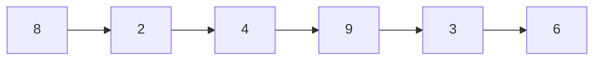

- Step 2.

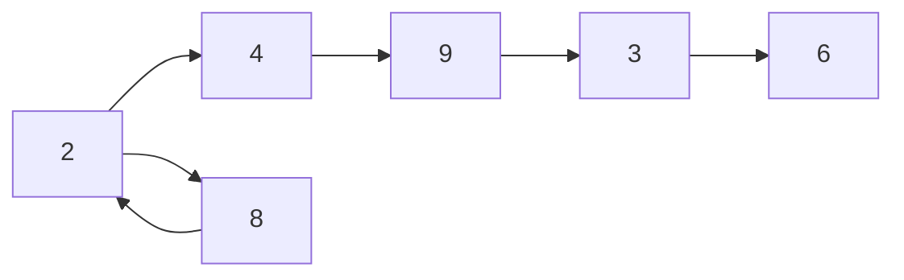

- Step 3.

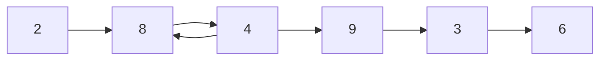

- Step 4.

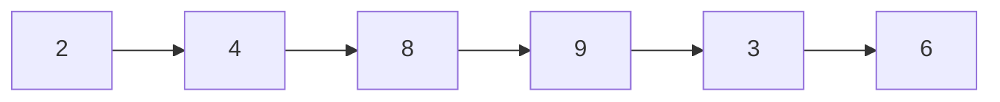

- Step 5.

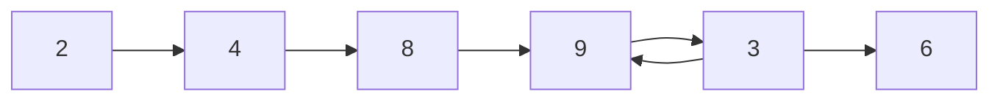

- Step 6.

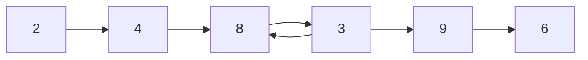

- Step 7.

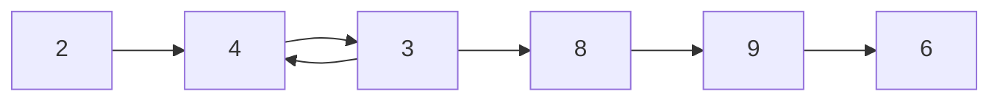

- Step 8.

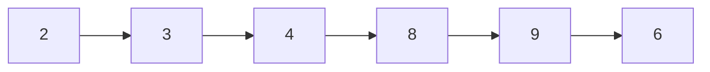

- Step 9.

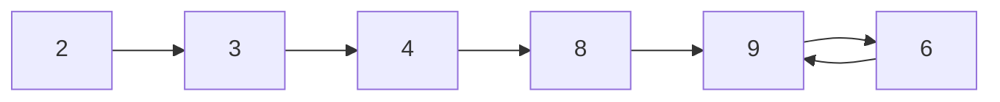

- Step 10.

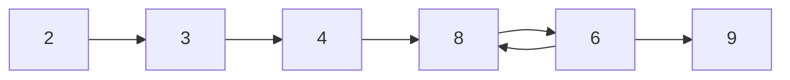

- Step 11.

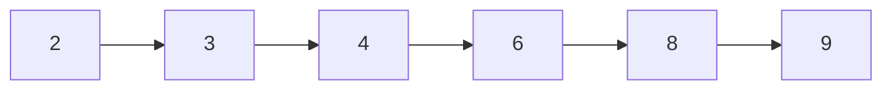

- ***Run command***  
`python insertion_sort.py`

- ***Source Code***

<pre name="code" class="python3">
array_num = [8, 2, 4, 9, 3, 6]
def insertion_sort(p_array):
    for j in range(1, len(p_array) - 1):
        key = p_array[j]
        i = j - 1
        while(i > 0 && p_array[i] > key):
            p_array[i+1], p_array[i] = p_array[i], p_array[i+1]
            i = i - 1
            key = p_array[i + 1]
    return p_array

print(insertion_sort(array_num))
 </pre>

#### Runing time

- Depends on input(eg. already sorted some part)  
- Depends on input size, elements size:
$6\times10^9$ Vs  $6$, (parameterize input size)  
- Upper bounds of the running time
   Gurantee to the user

### Kinds of alnalysis

*worst case*  
$T(n) =$ Max time On any inputs of size n  

*Avarage case*  
$T(n) =$ Expected time over all inputs of size n  
- Nedd assumption of statistical distribution of inputs

*Best case* (Bogus)
- All eles sorted already

### What is insertion sorts worst-case time

Depends on the computer running on  

- relative speed(On same machine)  
- absolute speed(On diff machine)

### IDEA

- Ignore machine dependent constants
- Look at growth of $T(n)$ as $n\rightarrow \infty$

### Asymptotic notation

- $\Theta$ Notation: Drop low order terms and ignore leading constants  
  - Ex: $3n^3 + 90n^2 - 5n + 6046 = \Theta(n^3)$
    - As $n\rightarrow \infty$, $\Theta(n^2) << \Theta(n^3)$

## Insetion sort analysis

- Worst case: input reverse sorted
  - $T(n) = \sum^{n}_{i = 1} \Theta(j) = \Theta(n^2)$(Arithmetic series)
- Is insertion sort fast
  - moderately fast for small n
  - Not at all for large n