# Analysis of Algorithm

[Opencaurse video address](https://www.bilibili.com/video/av9406674 "01 Introduction and Algorithm analysis")

*The theoretical study of computer program **performance** and ***resource usage****

## What's more important than performance

   Correctibility, feature, robustin etc...

## Why study algorithms and performance

   ~~Opening question, No anwser~~

## Problem: Sorting

- Input: sequance < a1, a2 ..., an> of numbers  
- Ouput: permutation of those < A1, A2 ..., An > numbers  
- *Such that: A1 < A2 < ... < An*

### Insertion sort

- *Pesudocode*

```pesudocode
Insertion_Sort(A, n) //Sorts A[1..n]
    for j <- 2 to n
        do key <- A[j]
            i <- (j-1)
            while i >= 0 and A[i] >= key
                do A[i + 1] <-> A[i]
                    i <- (i - 1)
                    key = A[i+1]
```

- Ex: Array [8 2 4 9 3 6], re-arrange with increasing sortion

- Analysis  
- - Step 1.

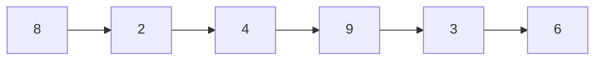

- - Step 2.

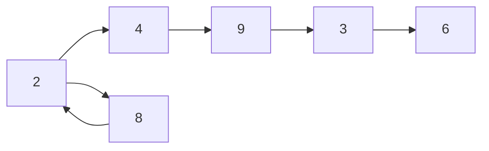

- - Step 3.

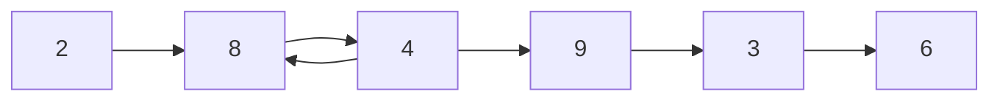

- - Step 4.

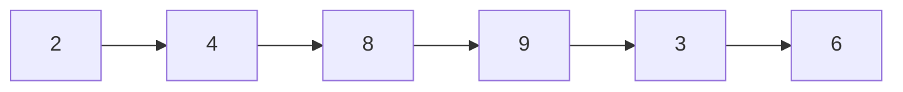

- - Step 5.

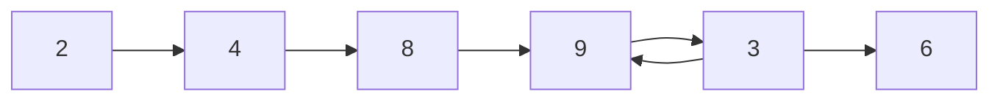

- - Step 6.

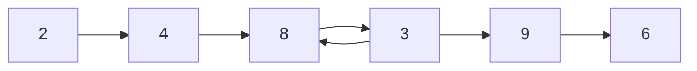

- - Step 7.

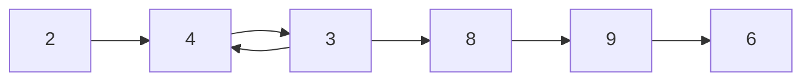

- - Step 8.

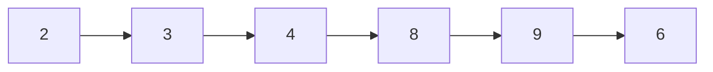

- - Step 9.

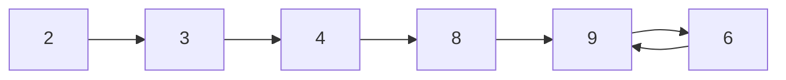

- - Step 10.

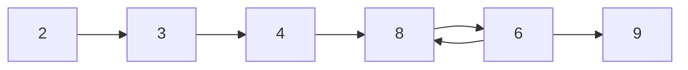

- - Step 11.

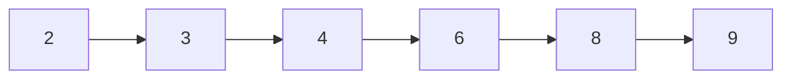

- ***Source Code***

```python
array_num = [8, 2, 4, 9, 3, 6]
def insertion_sort(p_array):
    for j in range(1, len(p_array) - 1):
        key = p_array[j]
        i = j - 1
        while(i > 0 && p_array[i] > key):
            p_array[i+1], p_array[i] = p_array[i], p_array[i+1]
            i = i - 1
            key = p_array[i + 1]
    return p_array

print(insertion_sort(array_num))
```

- Runing time

- Depends on input(eg. already sorted some part)  
- Depends on input size, elements size:
$6\times10^9$ Vs  $6$, (parameterize input size)  
- Upper bounds of the running time
   Gurantee to the user

### Kinds of alnalysis

*worst case*  
$T(n) =$ Max time On any inputs of size n  

*Avarage case*  
$T(n) =$ Expected time over all inputs of size n  

- Nedd assumption of statistical distribution of inputs

*Best case* (Bogus)

- All eles sorted already

### What is insertion sorts worst-case time

Depends on the computer running on  

- relative speed(On same machine)  
- absolute speed(On diff machine)

### IDEA

- Ignore machine dependent constants
- Look at growth of $T(n)$ as $n\rightarrow \infty$

### Asymptotic notation

- $\Theta$ Notation: Drop low order terms and ignore leading constants  
  - Ex: $3n^3 + 90n^2 - 5n + 6046 = \Theta(n^3)$
    - As $n\rightarrow \infty$, $\Theta(n^2) << \Theta(n^3)$

#### Insetion sort analysis

- Worst case: input reverse sorted
  - $T(n) = \sum^{n}_{i = 1} \Theta(j) = \Theta(n^2)$(Arithmetic series)
- Is insertion sort fast
  - moderately fast for small n
  - Not at all for large n

### Merge sort

Merge sort A[1..n]

- ***pesudocode***

```pesudocode
1. If n = 1, done // Time = O(1)
2. Recursively sort
    A[1...[n/2]] and
    A[[n/2]+1..n]
3. Merge 2 sorted lists
```

- Analysis Key subroutine Merge

- - step 1

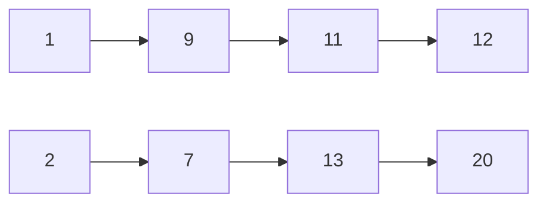

- - step 1

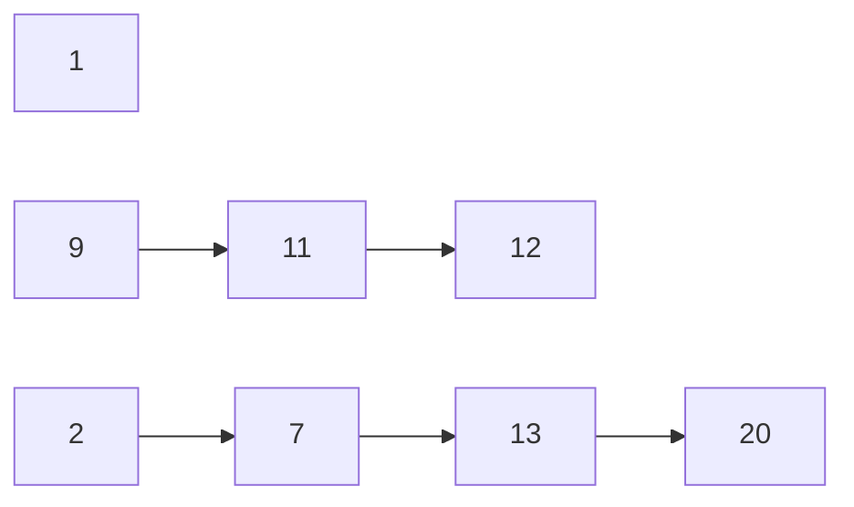

- - step 2

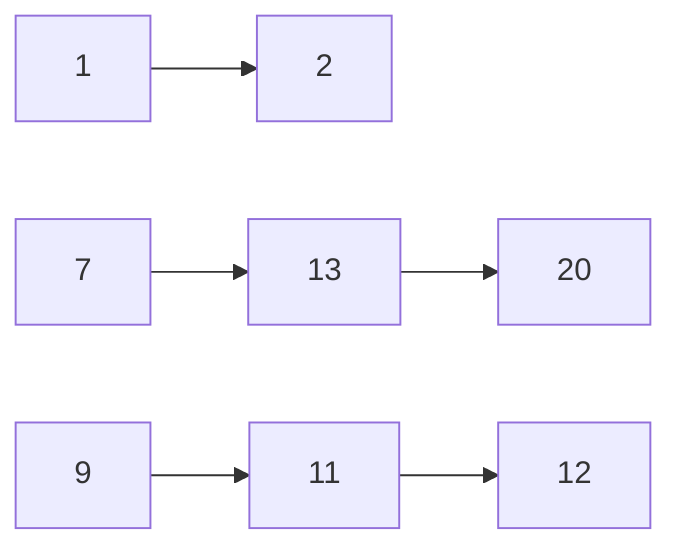

- - step 3

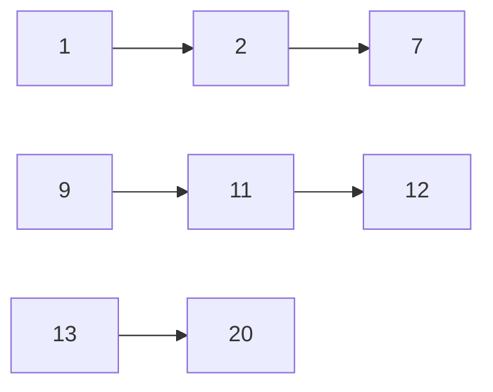

- - step 4

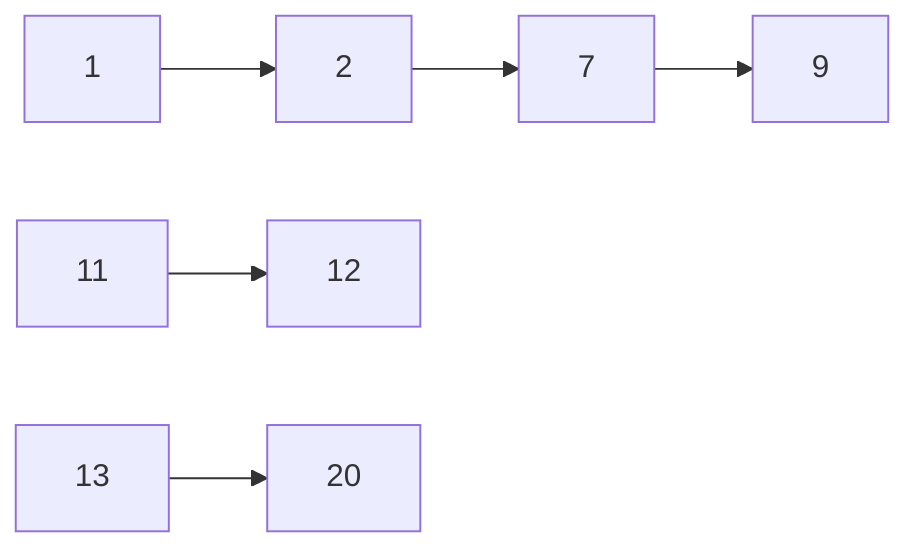

- - step 5

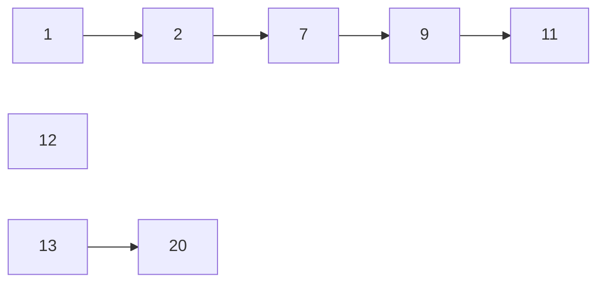

- - step 6

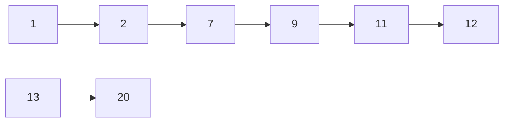

- - step 7

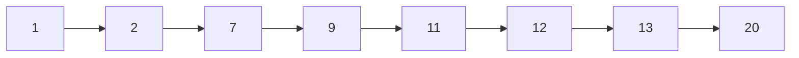

- Running time
  - $TimeMerge(n) = \Theta(n)$ on n total elements
  - $TimeRecur=\begin{cases}\Theta(1) &n = 1\\2T(n/2) + \Theta(n) &n > 1\end{cases}$
  - Recrusion tree, $T(n) = 2T(n/2) + Cn$, constant $c>0$

    - Expression

 ```mermaid
graph TB;
    root0(Cn)-->root1(Tn/2);
    root0(Cn)-->root2(Tn/2);
 ```

 ```mermaid
graph TB;
    root0(Cn)-->root1(Cn/2);
    root0(Cn)-->root2(Cn/2);
    root1(Cn/2)-->root3(Tn/4);
    root1(Cn/2)-->root4(Tn/4);
    root2(Cn/2)-->root5(Tn/4);
    root2(Cn/2)-->root6(Tn/4);
 ```

 ```mermaid
graph TB;
    root0(Cn)-->root1(Cn/2);
    root0(Cn)-->root2(Cn/2);
    root1(Cn/2)-->root3(Cn/4);
    root1(Cn/2)-->root4(Cn/4);
    root2(Cn/2)-->root5(Cn/4);
    root2(Cn/2)-->root6(Cn/4);
    root3(Cn/4)-->root7(...);
    root3(Cn/4)-->root8(...);
    root4(Cn/4)-->root9(...);
    root4(Cn/4)-->root10(...);
    root5(Cn/4)-->root11(...);
    root5(Cn/4)-->root12(...);
    root6(Cn/4)-->root13(...);
    root6(Cn/4)-->root14(...);
    root7(...)-->root15(Theta_1);
    root7(...)-->root16(Theta_1);
    root8(...)-->root17(Theta_1);
    root8(...)-->root18(Theta_1);
    root9(...)-->root19(Theta_1);
    root9(...)-->root20(Theta_1);
    root10(...)-->root21(Theta_1);
    root10(...)-->root22(Theta_1);
    root11(...)-->root23(Theta_1);
    root11(...)-->root24(Theta_1);
    root12(...)-->root25(Theta_1);
    root12(...)-->root26(Theta_1);
    root13(...)-->root27(Theta_1);
    root13(...)-->root28(Theta_1);
    root14(...)-->root29(Theta_1);
    root14(...)-->root30(Theta_1);
 ```

- Analysis time complexity
  - The depth of the tree: $\log_2(n)$
  - Time complexity of every layer: $Cn$
  - Time complexity of leaves, add leaves up: $\Theta(n)$, why $\Theta(n)$, not $n$
  - The whole expression: $T(n) = \log_2(n)Cn + \Theta(n)$
    - $T(n) = \Theta(n\log_2(n))$

- ***source code***

```python
Array = [6, 5, 3, 1, 8, 7, 2, 4]

def merge(left, right):
    result = []
    while len(left) > 0 and len(right) > 0 :
        if left[0] < right[0]:
            result.append(left.pop(0))
        else:
            result.append(right.pop(0))
    result += left
    result += right
    print("result is:", result)
    return result


def merge_sort(arry):
    if len(arry) == 1:
        return arry
    center = len(arry) // 2
    left = arry[:center]
    right = arry[center:]
    l1 = merge_sort(left)
    r1 = merge_sort(right)

    return merge(l1, r1)

print(merge_sort(Array))
```
