# Analysis of Algorithm

*The theoretical study of computer program **performance** and resource usage*

## What's more important than performance ?
   Correctibility, feature, robustin etc...

## Why study algorithms and performance ?
   ~~Opening question, No anwser~~

## Problem: Sorting
   Input: sequance < a1, a2 ..., an> of numbers  
   Ouput: permutation of those < A1, A2 ..., An > numbers  
   *Such that: A1 < A2 < ... < An*

### Insertion sort

*pesudocode*  
<pre>
Insertion_Sort(A, n) //Sorts A[1..n]
    for j <- 2 to n
        do key <- A[j]
            i <- (j-1)
            while i > 0 and A[i] > key
                do A[i + 1] <- A[i]
                    i <- (i - 1)
            A[i + 1] <- Key
</pre>

#### Ex: Array [8 2 4 9 3 6], re-arrange with increasing sortion
##### Analysis:  
   Step 1.
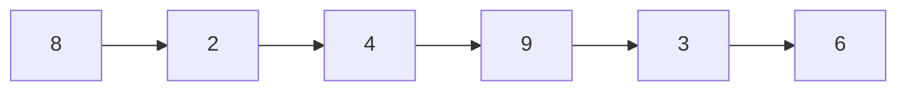
   Step 2.
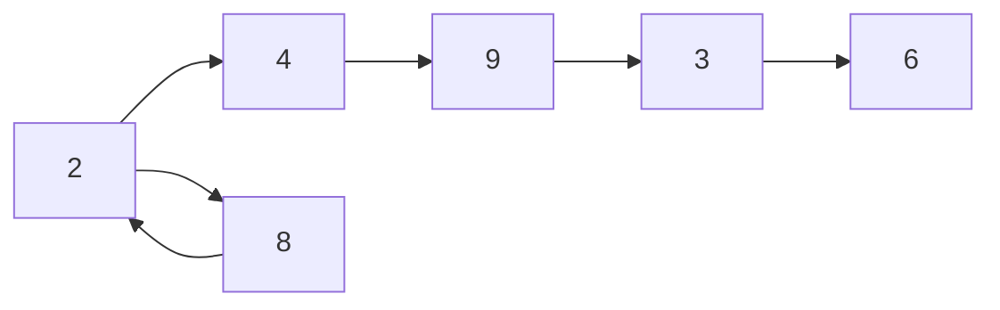
   Step 3.
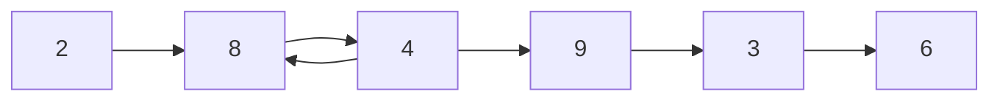
   Step 4.
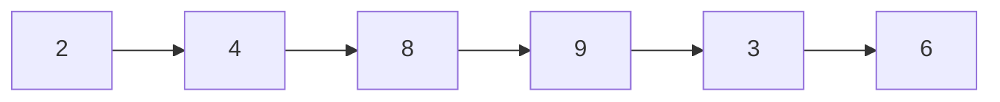
   Step 5.
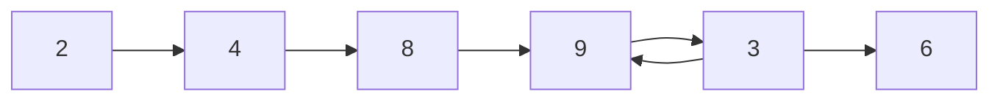
   Step 6.
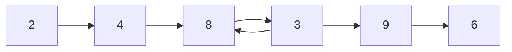
   Step 7.
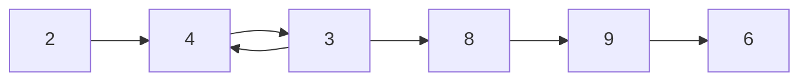
   Step 8.
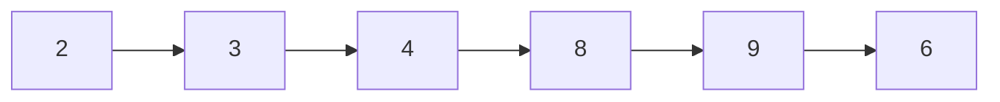
   Step 9.
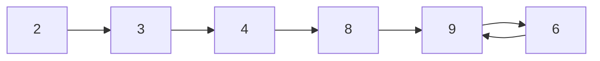
   Step 10.
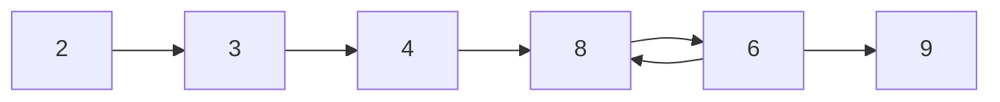
   Step 11.
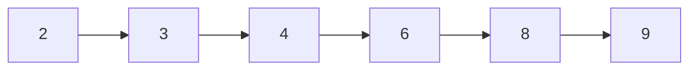
***Run command***  
`python insertion_sort.py`  
***Source Code***  
<pre name="code" class="python3">
array_num = [8, 2, 4, 9, 3, 6]
def insertion_sort(p_array):
    for j in range(1, len(p_array) - 1):
        key = p_array[j]
        i = j - 1
        while(i > 0 && A[i] > key):
            A[i+1], A[i] = A[i], A[i+1]
            i--
        A[i+1] = key

insertion_sort(array_num)
 </pre>